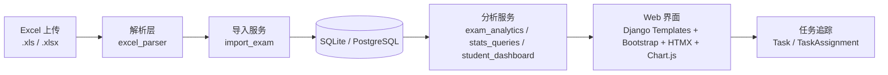

<div align="center">

# GradeInsight

**班级成绩分析与任务追踪平台（Django + Bootstrap + HTMX + Chart.js）**

<p>
  
  
  
  
  
  
</p>

</div>

---

## 项目简介
GradeInsight 是一个面向教学场景的成绩分析系统，围绕“**导入 Excel -> 生成分析 -> 精准筛选学生 -> 跟踪任务完成**”的闭环流程设计。

系统已支持两类 Excel 数据源：
- 班级汇总表（`.xlsx`，多工作表）
- 学生单科成绩单（`.xls`，单表多成绩单块）

适配桌面与 iPad 页面，支持教学过程中的快速分析与执行。

---

## 核心能力

| 模块 | 能力 | 说明 |
|---|---|---|
| 数据导入 | 支持 `.xls` / `.xlsx` | 自动识别并解析不同结构的考试文件 |
| 考试分析 | 多图表 + 多指标 | 分数分布、成绩段、通过率、优秀率、分位数、离散度 |
| 学生分析 | 学生档案与趋势 | 历次成绩、班级排名、题目强弱项 |
| 任务系统 | 作业/补救闭环 | 按筛选结果建任务，支持“已交/未交”状态切换 |
| 可运维 | 测试 + Docker | 支持 `pytest`、`docker-compose`、运行文档 |

---

## 页面概览

| 页面 | 路由 | 说明 |
|---|---|---|
| 考试总览 | `/gradebook/exams/` | 查看考试列表，进入单场分析 |
| 考试详情 | `/gradebook/exams/<exam_id>/` | 4 图表分析 + Top 成绩 + 关注学生 |
| 学生档案 | `/gradebook/students/` | 学生名单、考试次数、任务完成摘要 |
| 学生详情 | `/gradebook/students/<student_id>/` | 历次成绩、班排趋势、任务完成/未完成 |
| 题目筛选 | `/gradebook/exams/<exam_id>/filter/` | 按题号与规则筛选学生并建任务 |
| 任务清单 | `/worklists/tasks/` | 管理任务、切换提交状态、导出未交 CSV |
| 导入成绩 | `/gradebook/import/` | 上传 Excel，预览后确认入库 |

---

## 数据与分析能力说明

### 1) 考试级分析
- 基础统计：平均分、中位数、最高分、最低分、统计人数
- 结构指标：通过率、优秀率、成绩段分布
- 离散指标：标准差、IQR、分位数（P25/P50/P75/P90）
- 能力维度：客观分/主观分均值
- 题目维度：高表现题、薄弱题

### 2) 学生级分析
- 历次考试成绩与班级排名趋势
- 选中考试的题目弱项/强项对比
- 任务完成情况（未完成任务、已完成任务、汇总计数）

### 3) Excel 解析策略
- `.xlsx`：优先读取 `得分明细` 工作表，兼容多工作表数据
- `.xls`：解析连续“学生成绩单块”，抽取题号、得分与总分

---

## 技术架构



---

## 本地运行（推荐 Conda）

### 1. 创建环境
```bash
conda create -n gradeinsight python=3.12 -y
conda activate gradeinsight
```

### 2. 安装依赖
```bash
pip install -r requirements.txt
```

### 3. 数据库迁移
```bash
python manage.py migrate
```

### 4. 启动服务
```bash
python manage.py runserver 0.0.0.0:8000
```

访问：`http://127.0.0.1:8000/login/`

---

## 测试与质量

```bash
pytest -q
python manage.py check
```

当前代码包含：
- 导入解析测试
- 页面访问与登录保护测试
- 分析逻辑测试
- 任务状态切换与 CSRF 交互测试

---

## Docker 部署

```bash
docker-compose up -d --build
```

相关文件：
- `docker-compose.yml`
- `docker/web/Dockerfile`
- `docker/caddy/Caddyfile`
- `docs/runbook/deploy.md`

---

## 项目结构

```text
gradeinsight/
├── config/                 # Django 配置
├── gradebook/              # 成绩导入与分析
│   ├── services/           # 解析与分析服务层
│   ├── templates/gradebook/
│   └── tests/
├── worklists/              # 任务追踪模块
├── templates/              # 基座模板与登录页
├── static/                 # 样式与前端资源
├── docs/                   # 需求、计划、运维文档
└── docker/                 # 容器化配置
```

---

## 里程碑
- [x] 支持 `.xls` / `.xlsx` 双格式导入
- [x] 考试详情多图表分析与指标扩展
- [x] 学生档案页（成绩 + 排名 + 任务状态）
- [x] 任务切换状态（HTMX + CSRF）稳定修复
- [ ] 学生列表高级筛选（按班级/风险等级）
- [ ] 分析结果导出（图表 + 报表）

---

## 许可证
当前仓库未显式声明 License。若用于生产或对外分发，建议补充 `LICENSE` 文件。
